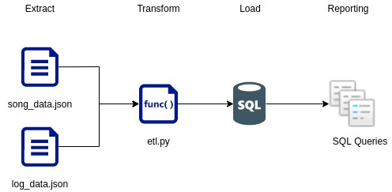
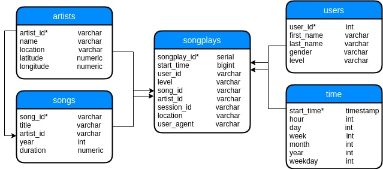

## Udacity DE: Project 1 - Data Modeling with Postgres

### Summary

Discuss the purpose of this database in the context of the startup, Sparkify, and their analytical goals.
State and justify your database schema design and ETL pipeline.
[Optional] Provide example queries and results for song play analysis.

#### Architecture

#### Files

##### Raw Data
1. `song_data.json` - [Million Song Dataset](http://millionsongdataset.com/); JSON format and contains metadata about a song and the artist of that song. The files are partitioned by the first three letters of each song's track ID

2. `log_data.json` -  log files in JSON format generated by this event simulator based on the songs in the dataset above. These simulate activity logs from a music streaming app based on specified configurations.

##### ETL
1. `create_tables.py` - drops and creates your tables. You run this file to reset your tables before each time you run your ETL scripts.
2. `sql_queries.py` - contains all your sql queries, and is imported into the last three files above
3. `etl.py` -  reads and processes files from song_data and log_data and loads them into your tables. You can fill this out based on your work in the ETL notebook.
4. `etl.ipynb` -  reads and processes a single file from song_data and log_data and loads the data into your tables. This notebook contains detailed instructions on the ETL process for each of the tables.
5. `test.ipynb` - displays the first few rows of each table to let you check your database.

#### Tables + Fields

### Processing the Data

### Steps to Running ETL Pipeline

1. Run create_tables.py to create your database and tables. Optional script for QA: quality_checks.py 
2. Run test.ipynb to confirm the creation of your tables with the correct columns. Make sure to click "Restart kernel" to close the connection to the database after running this notebook.
3. Run etl.py to process the datasets
4. Run test.ipynb to test records were added

**NOTE**: You will not be able to run test.ipynb, etl.ipynb, or etl.py until you have run create_tables.py at least once to create the sparkifydb database, which these other files connect to.

### Query Samples

### Add-ons
1. `quality_checks.py` - Run after create_tables.py. Will output user-defined tables in the database as well as column names in each tables.

#### Reporting

#### Sample Architecture on Google Cloud Platform 

